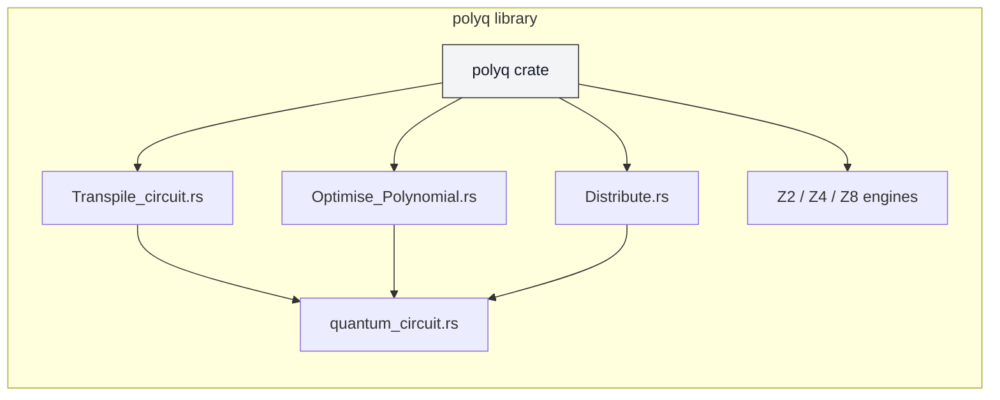

PolyQ
=====

Overview
--------

PolyQ is a high-performance, distributed ring-polynomial quantum statevector simulator focused on circuit optimisation, verification, and measuring quantum complexity. The core library is implemented in Rust (sources in `src/`) and is accompanied by Theory and notebooks in `Resources/` and `Benchmark/`.


Quick start
-----------

1. Install Rust (if not installed):

```bash
curl --proto '=https' --tlsv1.2 -sSf https://sh.rustup.rs | sh
```

2. (Optional) Python notebooks — create a virtual environment and install requirements:

```bash
python3 -m venv .venv
source .venv/bin/activate
pip install -r requirements.txt
```

3. Build and test the Rust crate:

```bash
cargo build --release
cargo test
```

4. Generate local docs:

```bash
cargo doc --no-deps --open
```

Architecture (high level)
-------------------------

The repository is organised around a Rust library (`src/`) with pipeline modules for transpilation, optimisation, distribution, and multiple algebraic engines. The following Mermaid diagram provides a compact overview of the layout and relationships.



Development notes
-----------------

- Build (debug): `cargo build`
- Build (release): `cargo build --release`
- Test: `cargo test` (use `cargo test <name>` for a specific test)
- Format: `cargo fmt` (install via `rustup component add rustfmt`)
- Lint: `cargo clippy` (install via `rustup component add clippy`)
- Docs: `cargo doc --no-deps --open`
- Benchmarks: `cargo bench` or run `Benchmark/benchmark.rs` and the notebooks in `Benchmark/`.

Python / Notebooks
------------------

- Create and activate a venv: `python3 -m venv .venv` then `source .venv/bin/activate`.
- Install dependencies: `pip install -r requirements.txt`.
- Open notebooks: `jupyter notebook` and open files in `Benchmark/`.

Using the crate from other Rust projects
---------------------------------------

Add the local crate by path in the other project's `Cargo.toml`:

    [dependencies]
    polyq = { path = "../PolyQ" }

Contributing
------------

Please open PRs with tests and documentation updates for public APIs. Run `cargo fmt` and `cargo clippy` before submitting changes.


License
-------

See the `LICENSE` file in the repository root for terms.

