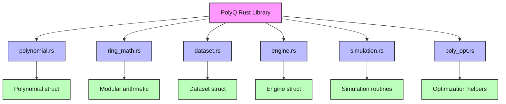

# Rust Benchmark Instructions

This directory contains a Rust benchmark for quantum circuit simulation.

## Prerequisites
- [Rust toolchain](https://www.rust-lang.org/tools/install) (install via `rustup`)

## Building the Rust Library

From the root of the repository or inside the `Rust_Benchmark` directory, run:

```
cargo build --release
```

This will build all Rust code in release mode for best performance. The compiled binaries will be located in `../target/release/`.

## Running the Benchmark

To run the benchmark executable:

```
cargo run --release --bin Benchmark -- <N> <G> <SEED>
```
- `<N>`: Number of qubits (default: 8)
- `<G>`: Number of gates (default: 1000)
- `<SEED>`: Random seed (default: 42)

Example:

```
cargo run --release --bin benchmarker -- 10 2000 123
```

Alternatively, you can run the binary directly after building:

```
../target/release/Benchmakr 10 2000 123
```

## Output
The benchmark prints the number of qubits, number of gates, elapsed time, gates per second, and the final statevector norm for correctness checking.

## Building and Viewing Rust Documentation

You can generate and view documentation for the Rust code using Cargo's built-in doc tool.

To build the documentation, run:

```
cargo doc --no-deps --open
```

This will build the documentation for the project and open it in your default web browser. You can also find the generated docs in the `target/doc/` directory.

For more details on documenting Rust code, see: https://doc.rust-lang.org/rustdoc/how-to-write-documentation.html


## PolyQ Architecture

The following flowchart illustrates the architecture of the PolyQ backend and its benchmark integration:

